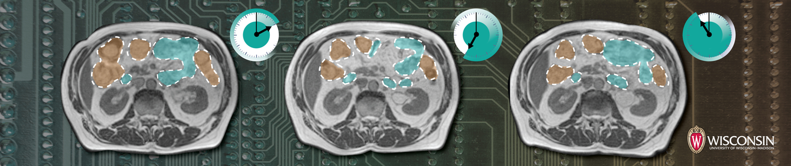
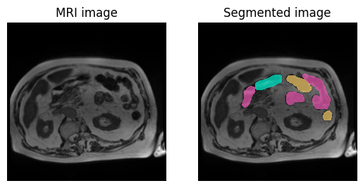
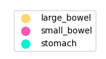
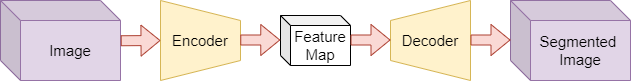
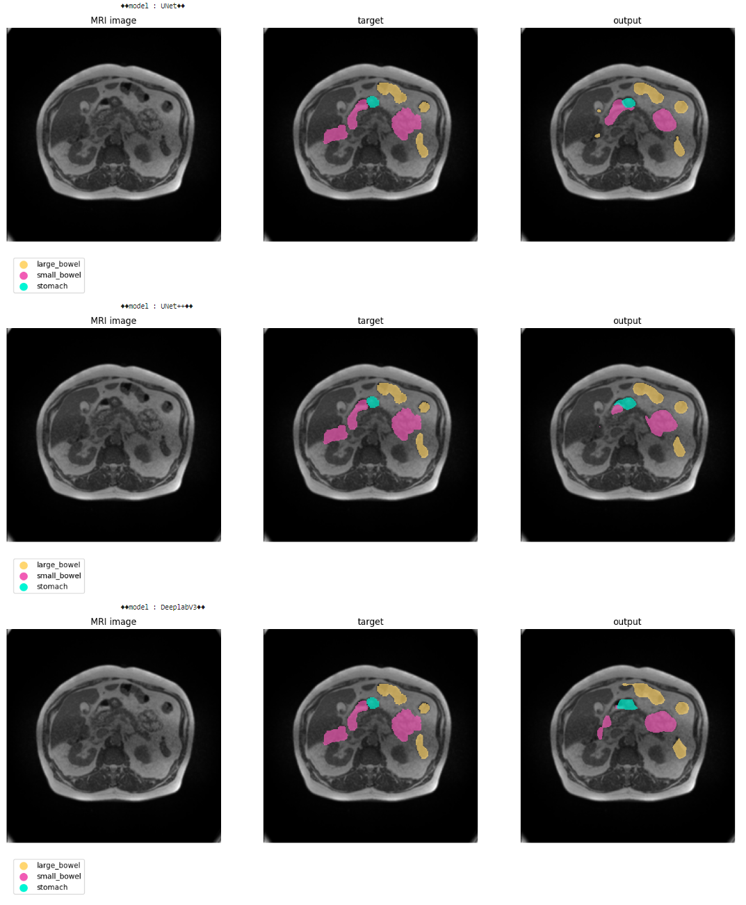

  

<h1 align="center">Medica Image Segmentation</h1>

This repository serves as the template for the third project in the Deep Catalyst course, focusing on medical image segmentation. Explore and utilize this template to kickstart your own medical image segmentation projects, leverage best practices, and accelerate your journey into the world of precise medical diagnostics through deep learning.

  
  

## 1. Problem Statement

Medical image segmentation is a critical task in healthcare, involving the delineation of regions of interest (ROIs) within medical images, such as organs and tumors. In this project, the goal is to develop a deep learning model that can accurately segment MRI images to differentiate between the stomach, intestines, and cancerous tumors. This process requires classifying each pixel in the image, with background pixels assigned a value of zero. Since we are transforming one image into a segmented version of the same image, the appropriate model architecture for this task is an encoder-decoder network. This architecture is well-suited for pixel-wise image-to-image translation tasks, where the encoder extracts features from the input MRI image, and the decoder reconstructs a segmented output image.

  

## 2. Related Works
#### ◼ DeepLab v3+ [https://arxiv.org/abs/1706.05587](https://arxiv.org/abs/1706.05587)
#### ◼ U-Net [https://doi.org/10.1007/978-3-319-24574-4_28](https://doi.org/10.1007/978-3-319-24574-4_28)
#### ◼ ResUNet++ [https://doi.org/10.1109/ISM46123.2019.00049](https://doi.org/10.1109/ISM46123.2019.00049)

## 3. The Proposed Method
I trained all three models (**UNet**, **UNet++**, and **DeepLab**) and measured the **Loss Dice** and **Accuracy Dice** values. The results are as follows:

| Model       | Loss Dice | Accuracy Dice |
|-------------|-----------|---------------|
| UNet        | 0.239    | 0.775        |
| UNet++      | 0.285    | 0.776       |
| DeepLab     | 0.257    | 0.755        |

And the models outputs are:

  

## 4. Implementation
This section delves into the practical aspects of the project's implementation.

### 4.1. Dataset
Under this subsection, you'll find information about the dataset used for the medical image segmentation task. It includes details about the dataset source, size, composition, preprocessing, and loading applied to it.
[Dataset](https://www.kaggle.com/competitions/uw-madison-gi-tract-image-segmentation/data)

### 4.2. Model
In this subsection, the architecture and specifics of the deep learning model employed for the segmentation task are presented. It describes the model's layers, components, libraries, and any modifications made to it.

### 4.3. Configurations
This part outlines the configuration settings used for training and evaluation. It includes information on hyperparameters, optimization algorithms, loss function, metric, and any other settings that are crucial to the model's performance.

### 4.4. Train
Here, you'll find instructions and code related to the training of the segmentation model. This section covers the process of training the model on the provided dataset.

### 4.5. Evaluate
In the evaluation section, the methods and metrics used to assess the model's performance are detailed. It explains how the model's segmentation results are quantified and provides insights into the model's effectiveness.

