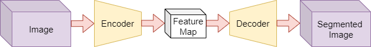

  

<h1 align="center">Medica Image Segmentation</h1>

This repository serves as the template for the third project in the Deep Catalyst course, focusing on medical image segmentation. Explore and utilize this template to kickstart your own medical image segmentation projects, leverage best practices, and accelerate your journey into the world of precise medical diagnostics through deep learning.

## 1. Problem Statement

Medical image segmentation is a critical task in healthcare, involving the delineation of regions of interest (ROIs) within medical images, such as organs and tumors. In this project, the goal is to develop a deep learning model that can accurately segment MRI images to differentiate between the stomach, intestines, and cancerous tumors. This process requires classifying each pixel in the image, with background pixels assigned a value of zero. Since we are transforming one image into a segmented version of the same image, the appropriate model architecture for this task is an encoder-decoder network. This architecture is well-suited for pixel-wise image-to-image translation tasks, where the encoder extracts features from the input MRI image, and the decoder reconstructs a segmented output image.

  

## 2. Related Works
#### ◼ DeepLab v3+ [https://arxiv.org/abs/1706.05587](https://arxiv.org/abs/1706.05587)
#### ◼ U-Net [https://doi.org/10.1007/978-3-319-24574-4_28](https://doi.org/10.1007/978-3-319-24574-4_28)
#### ◼ ResUNet++ [https://doi.org/10.1109/ISM46123.2019.00049](https://doi.org/10.1109/ISM46123.2019.00049)

## 3. The Proposed Method
### **DeepLab v3+ [https://arxiv.org/abs/1706.05587](https://arxiv.org/abs/1706.05587)**

  

### **Core Idea of the Transformer Model**
The Transformer model replaces the traditional sequence-processing models like RNNs (Recurrent Neural Networks) and CNNs (Convolutional Neural Networks) with a mechanism called **self-attention**. Unlike RNNs, which process data sequentially, Transformers process all data points simultaneously, making them highly parallelizable and efficient for large datasets. The **self-attention mechanism** enables the model to focus on different parts of the input at once, weighing the importance of each element relative to others.

### **Why This Architecture is Chosen**
1. **Parallelization**: Transformers can handle large datasets more efficiently than RNNs or CNNs due to their ability to process all elements of an input simultaneously. This would be particularly useful in medical image segmentation, where large volumes of MRI images are often involved.
  
2. **Self-Attention for Localization**: In the context of medical image segmentation, focusing on relevant regions (e.g., organs and tumors) is critical. The self-attention mechanism allows the model to attend to crucial parts of the image (like tumor boundaries), improving accuracy. Instead of focusing solely on neighboring pixels like CNNs, the Transformer can consider long-range dependencies in the image, which is key for accurate segmentation in complex images.

3. **Scalability and Flexibility**: Transformers are scalable and adaptable to a wide range of tasks. By training on enough medical images, the model can generalize well across various MRI scans, despite noise, low contrast, or irregular shapes.

### **How This Model Addresses the Problem**
In medical image segmentation, the goal is to map an image to its pixel-wise classification. Here, the Transformer architecture can be adapted for **image-to-image translation** tasks by using an **encoder-decoder architecture**:
- **Encoder**: Extracts features from the input image, identifying patterns and structures relevant to segmentation (e.g., tumors, organs).
- **Self-Attention**: During encoding, the self-attention mechanism identifies key areas within the image that require special attention, which is crucial when distinguishing tumors from healthy tissue.
- **Decoder**: Uses this encoded information to generate a pixel-wise segmentation map, classifying each pixel as either tumor, organ, or background.

In this case, Transformers provide better accuracy in recognizing boundaries and subtle differences between organs and tumors, thanks to the global attention mechanism.

### **Why Chosen Over Other Models**
Traditional models like CNNs rely on convolution operations, which are restricted by local neighborhoods and might miss long-range dependencies. The Transformer, by utilizing self-attention, can capture relationships between distant pixels, making it ideal for handling complex medical images where subtle features spread across the image are critical for accurate segmentation.

In summary, the Transformer model, with its self-attention mechanism, provides a flexible and efficient approach to medical image segmentation, offering advantages in handling complex images with noise and irregular structures.
## 4. Implementation
This section delves into the practical aspects of the project's implementation.

### 4.1. Dataset
Under this subsection, you'll find information about the dataset used for the medical image segmentation task. It includes details about the dataset source, size, composition, preprocessing, and loading applied to it.
[Dataset](https://www.kaggle.com/competitions/uw-madison-gi-tract-image-segmentation/data)

### 4.2. Model
In this subsection, the architecture and specifics of the deep learning model employed for the segmentation task are presented. It describes the model's layers, components, libraries, and any modifications made to it.

### 4.3. Configurations
This part outlines the configuration settings used for training and evaluation. It includes information on hyperparameters, optimization algorithms, loss function, metric, and any other settings that are crucial to the model's performance.

### 4.4. Train
Here, you'll find instructions and code related to the training of the segmentation model. This section covers the process of training the model on the provided dataset.

### 4.5. Evaluate
In the evaluation section, the methods and metrics used to assess the model's performance are detailed. It explains how the model's segmentation results are quantified and provides insights into the model's effectiveness.

